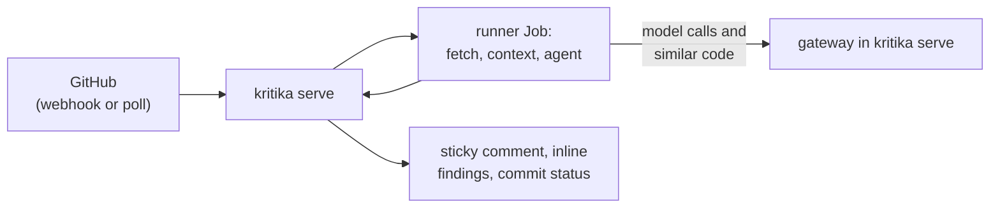

# kritika

**Repository-aware AI pull request review for GitHub.**

/// warning | Not production ready

kritika is under active development and has no release yet: configuration,
the database schema and the APIs change without notice, and there is no
upgrade path from one commit to the next.

///

kritika indexes a repository, reviews each pull request against that context,
posts one sticky summary comment plus inline findings and a commit status, and
answers follow-ups when the bot is @-mentioned. A pull request from a fork is
reviewed when a maintainer asks with `@<bot> review`. One deployment serves any
number of forge accounts, and every index and review job runs in its own
Kubernetes Job pod that holds no secrets.

## Features

- **Context beyond the diff.** Whole declarations the diff touches,
  definitions of identifiers on changed lines and callers of changed
  declarations, cut by tree-sitter, plus the most similar chunks from a
  VectorChord index of the default branch, and the issues the description
  says the pull request closes, which the review judges the change against.
- **An agent, not one prompt.** Each review is a bounded, read-only tool loop
  over the head commit, optionally with allowlisted commands (`gh`, `curl`,
  `fd`, `jq`, `rg`, `yq`) so it can read a dependency bump's release notes;
  `agent.maxSteps: 1` makes it one call.
- **Fixes you can apply.** A finding offers its fix as a one-click suggestion,
  with a prompt a coding agent can apply it from.
- **Incremental reviews.** A later push is reviewed against what changed since
  the last review, an earlier finding it no longer finds has its thread
  resolved, and `settle` folds a burst of force-pushes into one.
- **Follow-ups.** Someone with write access can @-mention the bot and get an
  answer in the thread.
- **Approvals, opt-in.** A repository or the instance can have a review that
  finds nothing blocking or important approve the pull request, and a later
  review that does withdraw it.
- **Providers and limits.** OpenRouter, OpenAI and Anthropic adapters, with
  per-account concurrency, daily review and monthly token caps. The provider
  key never enters a runner pod: the agent reaches its model through kritika's
  gateway.
- **Repository overrides.** A `.kritika.yaml`, read from the merge-base, can
  narrow the admin's settings and bring its own rules, context files and
  comment templates.
- **Configuration in git.** One YAML file holds the whole configuration, read
  at startup, and a change rolls the pods; secrets stay in Secrets, which reach
  kritika as environment variables.
- **Dashboard.** Sign-in, live review state, full model transcripts, the
  running configuration, repository on/off and an audit log.

## Where to next

- **[Setup](setup.md)**: install the chart, create the GitHub App, add a model
  key and an embedder, and get to the first review.
- **[Postgres with CloudNativePG](database.md)**: the database, its three
  roles, connection URIs, failover and backups.
- **[Configuration file](configuration.md)**: sign-in and role mappings, GitHub
  Apps, providers, defaults, repository entries and accounts.
- **[Repository settings](repository-config.md)**: what a repository's
  `.kritika.yaml` can change.
- **[Helm chart values](chart-values.md)**: the chart's values, grouped.
- **[Dashboard](dashboard.md)**: the setup checklist, the Configuration page,
  repository on/off and actions.
- **[Metrics](metrics.md)**: what kritika exports to Prometheus.
- **[Development](development.md)**: building, testing, evaluation and the
  cluster loop.
